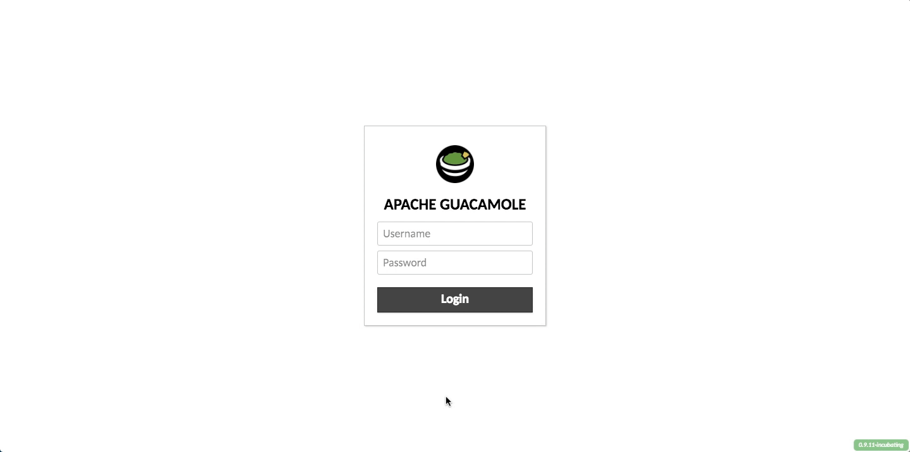

# Module 0: Access your Student Development Box

If you decided not to follow along with this lab on your local host with docker pre-installed, you can gain access to your cloud hosted student development box for development. This VM comes pre-installed with Docker and all dependencies required to complete this lab. 

This module will be used at ServTech 2017 for TechTables. Cloud hosted resources will **only** available during the alloted Session time slots. 

# Accessing your VM

1. Navigate to [https://portal.sl.americasreadiness.com](https://portal.sl.americasreadiness.com) to access your HTML5 bsed VM console through [Guacamole](https://vimeo.com/116207678).

2. Logon using your username and password : 
    * **Username:** User**X**
    * **Password:** XXXXXX (given out at the time of session)

    > **X** in "UserX" corresponds to your student number (1 through 7). For example, if you are student 1, you will logon with username `user1` and password `Password01`. 

3. You will enter directly into a CLI interface of an Ubuntu Docker host which you will use to learn more about docker. A few things to note about the HTML5 based console: 
	
    * If you need to change input methods to copy and paste text into the CLI, press the keys: `alt` + `ctrl` + `shift` to toggle the side pane. 
    * You can select  **None** which directly translates keyboard inputs into the CLI
    * You can select **Text Input** for a text form field entry to copy and paste large amounts of text. 
    * You can also select **On-Screen Keyboard** if you are on a tablet or touch screen device   without a proper keyboard input device. 
    * Be sure to use the **Clipboard** text box on the left. If you would like to paste text into the console, simply **right click into the CLI screen**. 
  
## Demonstration 



# Accessing NetScaler MAS and Student NetScaler ADC Admin Partition

You can logon to MAS at [https://mas.sl.americasreadiness.com](https://mas.sl.americasreadiness.com) at the time of your session, logging with credentials: 

**Username:** userX
**Password:** < Provided during the event > 

Each user will have a dedicated admin partition to deploy NetScaler Stylebooks to. 

# Setting up your IDE Environment 

To work with Stylebooks, we will deploy an IDE environment to work with YAML files and any python code to push out Stylebooks to NetScaler MAS. To begin follow the steps below to get started: 

### Step 1

Once you have CLI access via the browser console through Guacamole, enter the following commands to deploy your IDE environment powered by docker.

```
sudo /start-ide.sh
```

After a few moments your IDE service will start and after 30 seconds you will be able to access the GUI at : [https://userX-ide.sl.americasreadiness.com](https://userX-ide.sl.americasreadiness.com) 
  >**Note:** the `X` in `userX-ide` corresponds to your user number.

  Here is a list of all the URLs for the 7 student environments:
  [https://user1-ide.sl.americasreadiness.com](https://user1-ide.sl.americasreadiness.com)
  [https://user2-ide.sl.americasreadiness.com](https://user2-ide.sl.americasreadiness.com)
  [https://user3-ide.sl.americasreadiness.com](https://user3-ide.sl.americasreadiness.com)
  [https://user4-ide.sl.americasreadiness.com](https://user4-ide.sl.americasreadiness.com)
  [https://user5-ide.sl.americasreadiness.com](https://user5-ide.sl.americasreadiness.com)
  [https://user6-ide.sl.americasreadiness.com](https://user6-ide.sl.americasreadiness.com)
  [https://user7-ide.sl.americasreadiness.com](https://user7-ide.sl.americasreadiness.com)

You will notice in the left pane you have access to the repository data in Cloud9's interface and can open a `Stylebook.yaml` within the `code` directory if you'd like to explore a bit. 

## Demonstration 


# Shortcuts

1. [Introduction](../)
2. [Module 1: Create a LoadBalancing Stylebook](../Module-1)
3. [Module 2: Creating Composite Content Switching Stylebook](../Module-2)


