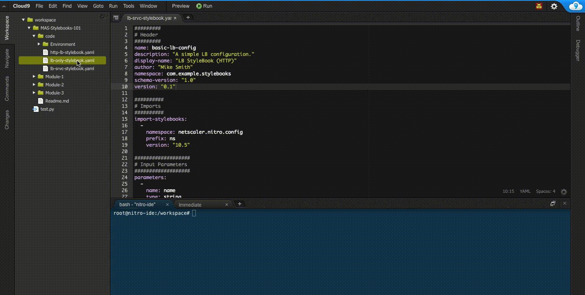

# Deploying StyleBooks with MAS

By default MAS comes with built-in StyleBooks to deploy select Enterprise Applications such as [Microsoft Skype](https://www.citrix.com/content/dam/citrix/en_us/documents/products-solutions/deploying-skype-for-business-server-2015-with-netscaler.pdf), [Microsoft Exchange](https://www.citrix.com/content/dam/citrix/en_us/documents/guide/deploying-netscaler-with-microsoft-exchange-2016.pdf), [Microsoft Sharepoint](https://www.citrix.com/content/dam/citrix/en_us/documents/guide/deploying-microsoft-sharepoint-2016-with-netscaler.pdf), as well as other StyleBooks to configure application delivery for [Load Balancing](http://docs.citrix.com/en-us/storefront/3/integrate-with-netscaler-and-netscaler-gateway/load-balancing-with-netscaler.html), [GSLB](https://support.citrix.com/article/CTX110348), and [Content Switching](https://docs.citrix.com/en-us/netscaler/11/traffic-management/content-switching.html). To view select built-in StyleBook's YAML source, [click here](../code/Built-in/). In addition to built-in StyleBooks, administrators can import their own custom StyleBooks. In this section, we will learn how to navigate NetScaler MAS' console to import a custom StyleBook, execute a StyleBook, and learn other ways to trigger StyleBooks via API calls using [`curl`](https://curl.haxx.se/)

### Step 1: Import your custom StyleBook into MAS

Logon to NetScaler MAS' administration console via the following link: [https://mas.sl.americasreadiness.com](https://mas.sl.americasreadiness.com) using the following credentials: 

* **Username:** userX
* **Password:** < Provided during the event > 

Each user will have a dedicated admin partition to deploy NetScaler StyleBooks to and dedicated user account within MAS to manage. 

Once logged in, navigate to the following administration pane: `Application > Configuration > StyleBooks` and then click the GUI button `Import StyleBook` to open the text editor where you can paste your newly created StyleBook. Once pasted, click `Create` to add. 

>See the demonstration below to know where to navigate and how. 



### Step 2: Deploy your StyleBook via MAS Web Console

Once the StyleBook is imported, it can be used to push out configurations by navigating to the `Application > Configuration` administrative pane and clicking `Create New`.

After selecting Create New, **Select** the StyleBook you have imported (likely at the bottom of the list) and fill out the form for end user input. 

**For Example, provide the following values for the input fields:**

  * **Application Name*:** Web-App
  * **Application Virtual IP (VIP)*:** 172.16.9.19
  * **LoadBalancing Algorithm:** LEASTCONNECTION
  * **Application Server IPs** -- Add two servers : 
	* *Server 1:* 
	* **IP Address of the Server**: 172.16.5.10
	* **Name of the service**: Entry-Portal-1
	* *Server 2:*
	* **IP Address of the Server**: 172.16.5.11
	* **Name of the service**: Entry-Portal-2
  * **Service Port:** 8080
  * **Target Instances:** < Select your Admin Partition >
 
Once completed, click `Create` to deploy your configuration and view the object created on your NetScaler instance. 

Here is a demonstration of the detailed steps from above: 


### Step 3: Observe the Load Balancer on MAS

Once the configurations have been deployed, NetScaler MAS should auto detect the service during its next polling interval. Lets now view the service in the [Application Dashboard](http://docs.citrix.com/en-us/netscaler-mas/12/application-analytics-and-management.html). 

Navigate to `Application > Dashboard` and view a Grey tile with your application name and instance details. You can click on the grey tile and navigate into more details by clicking the application name in the right `Appl info Panel` on the left. You will notice the service is in the `DOWN` state because we have not set up routing or hosted any backend service in this sandbox. Ideally in your environment with appropriate input values, you will see you service as `UP` and ready to process live traffic. 

In the top pane you can view additional details of the app under `Services` or `Configuration` for instance. You will see two services backing the LB vServer configured to load balance to back end services with the least connection. 

Here is a demonstration of the details steps from above: 


### Step 4: Trigger a Stylebook via curl

There are other ways to import and even trigger imported stylebooks with pre-defined parameter values for those use cases that incorporate automation tools to configure application delivery. For example, to integrate third party solutions to quickly configure Load Balancing services, the automation tool can issue a curl command within its function to publish an external facing web service. The curl command break down is as follows: 

>**Note:** For troubleshooting, logs of StyleBooks can be found in the file `/var/mps/log/stylebooks/sb_api_logger.log` within MAS. SSH into the MAS appliance and drop to the Operating System's shell by typing `shell` and then executing the following command : `tail -f /var/mps/log/stylebooks/sb_api_logger.log` to see API posts to the MAS service as you deploy StyleBooks via curl OR the MAS GUI. 

```bash
curl \
	-u ${mas-user}:${mas-password} \
	-XPOST  http://${mas-fqdn}/stylebook/nitro/v1/config/stylebooks/${style.book.namespace}/${stylebook.version}/${stylebook-name}/configpacks \
	-d \
'{
  "configpack": {
    "parameters": {
      "name": "web-app-2",
      "ip": "10.0.18.50",
      "lb-virtual-port": "8080",
      "lb-alg ": "ROUNDROBIN",
      "svc-servers": [
        {
          "ip": "192.18.188.1",
          "svc-name": "test-1"
        },
        {
          "ip": "18.188.18.10",
          "svc-name": "test-2"
        }
      ],
      "svc-port": "8080"
    },
    "target_devices": [
      {
        "id": "bf59f09b-69e9-4623-8604-052d49a7a38c"
      }
    ]
  }
}'
```

Required parameters for the `curl` command include :

* **${mas-user}**: Username of MAS Administrator deploying the stylebook
* **${mas-password}**: Password of the MAS Administrator 
* **${mas-fqdn}**: MAS URL to post the NITRO call
* **${style.book.namespace}**: Namespace of the StyleBook (as defined in the [Header](../))
* **${stylebook.version}**: The Version of the Stylebook imported in MAS
* **${stylebook-name}**: The Name of the desired Stylebook

The rest of the curl command consists of the input [parameters](../) defined in the StyleBook. In our case we have 

StyleBook Parameter Input | Translated Value
--- | ---
name | LB vServer Name
ip  | LB vServer VIP
lb-virtual-port | LB vServer Port
lb-alg | LB method on vServe
svc-servers | List of IPs (ip) and service names (svc-name) of back end servers
svc-port | Port the backend service is hosted on
id | UUID of the target instance in MAS' inventory DB. This can be determined from MAS' logs or the following curl command shown below. 

### Obtaining your NetScaler's UUID

In the command above there is a parameter `id` which determines which NetScaler to issue this Stylebook configuration to. You can obtain the UUID value by entering in the following command by substituting `{your-variables}`: 

```bash
curl --insecure  -u {mas-admin}:{mas-password} -X GET https://{mas-fqdn-or-ip}/nitro/v1/config/ns?filter=display_name:{target-NSIP} | python -m json.tool | sed -n 's/^[[:space:]]*"id"[[:space:]]*:[[:space:]]*//p'   
```
